# Measure impact of Singapore data center on Wikimedia usage
Codebase to [T184677](https://phabricator.wikimedia.org/T184677)

## Wikimedia Pageviews

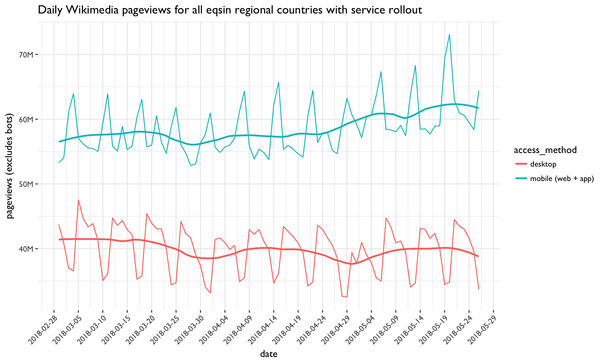

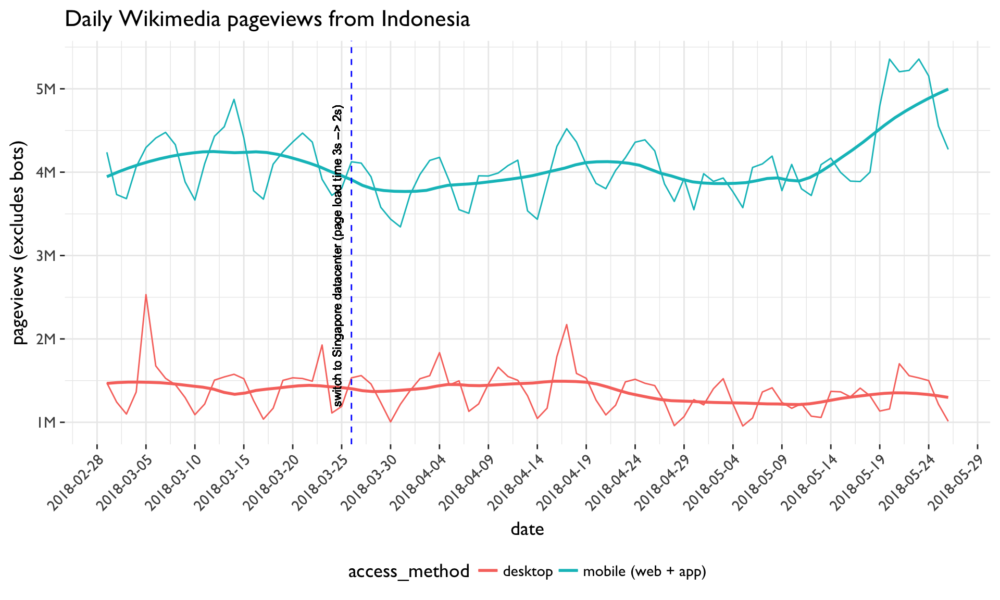

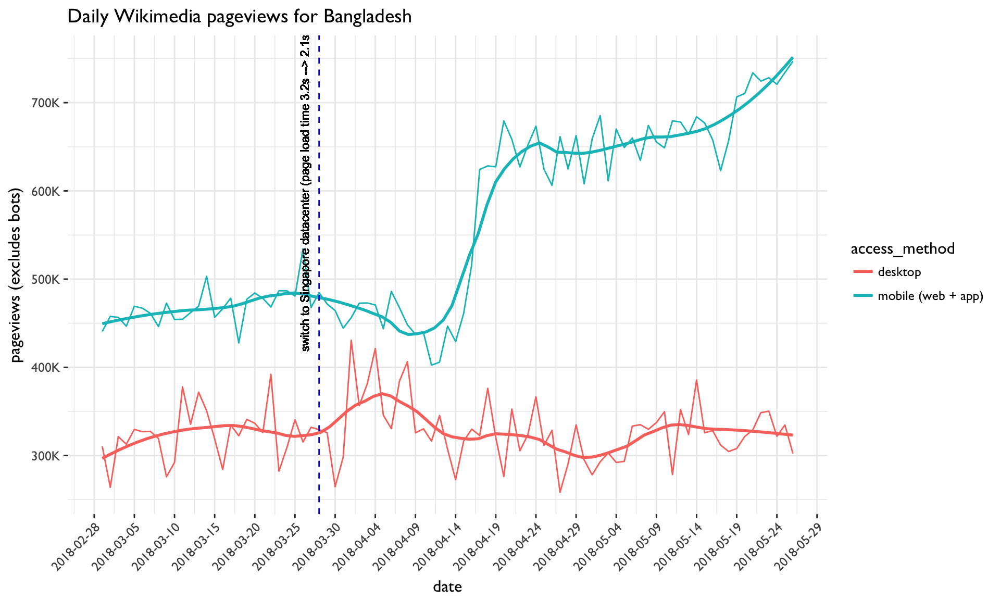

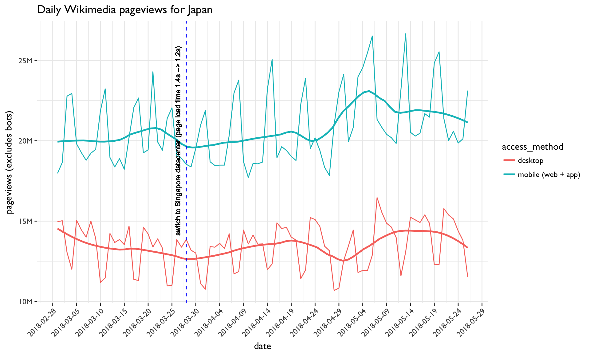

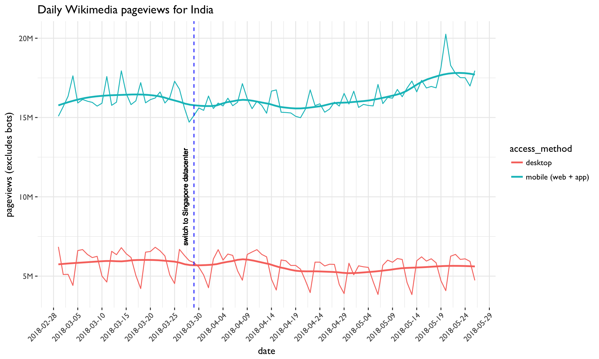

## Daily unique devices estimate

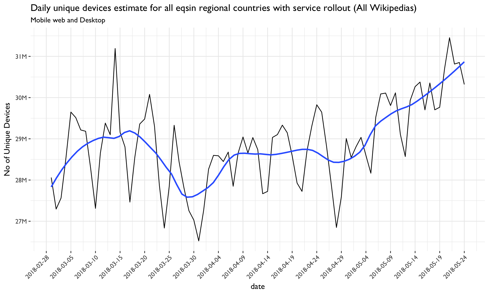

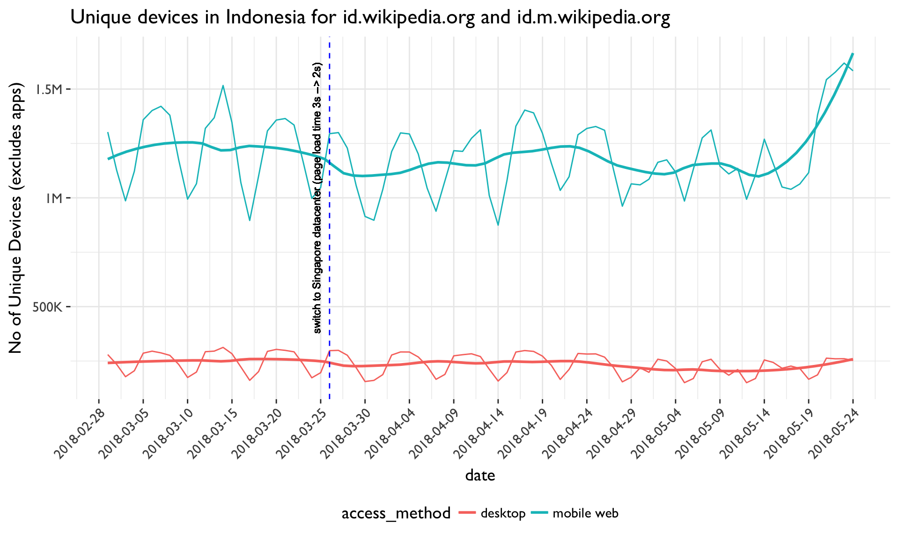

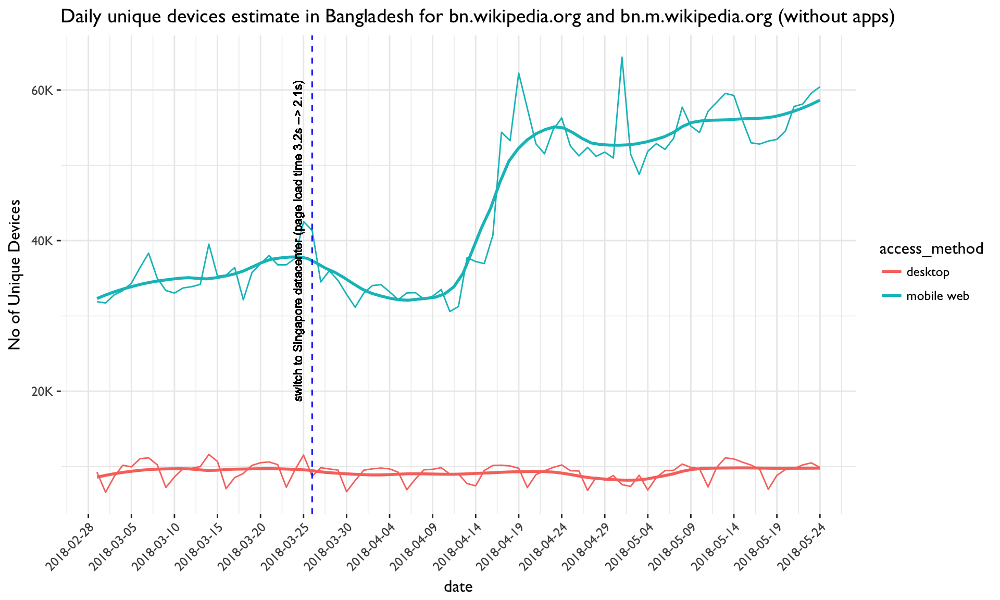

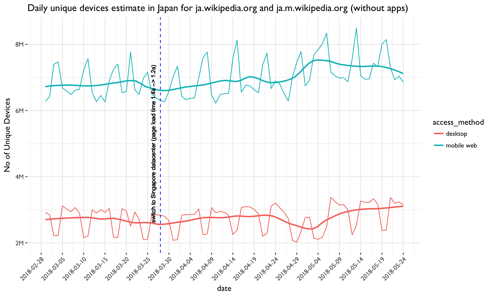

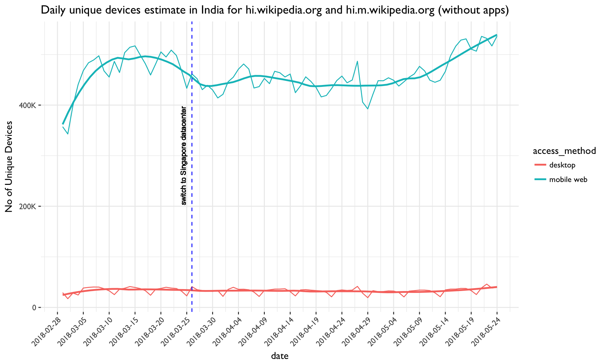

## User retention (average returns within 31 days)

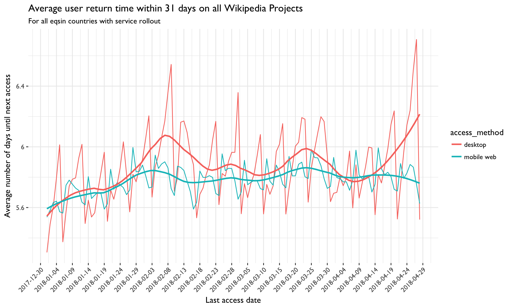

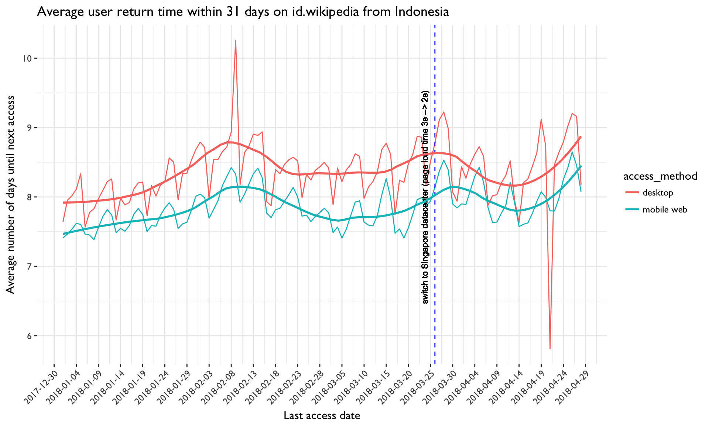

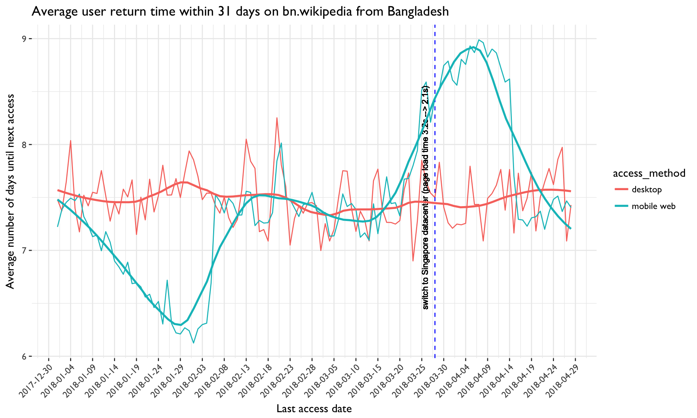

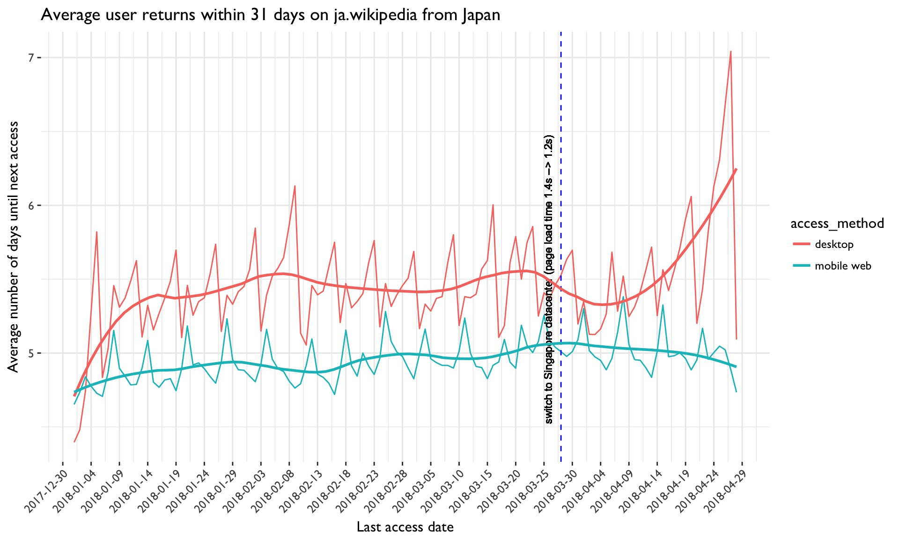

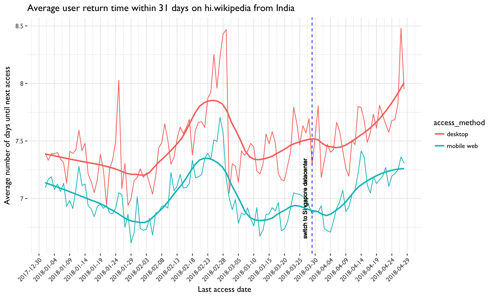

