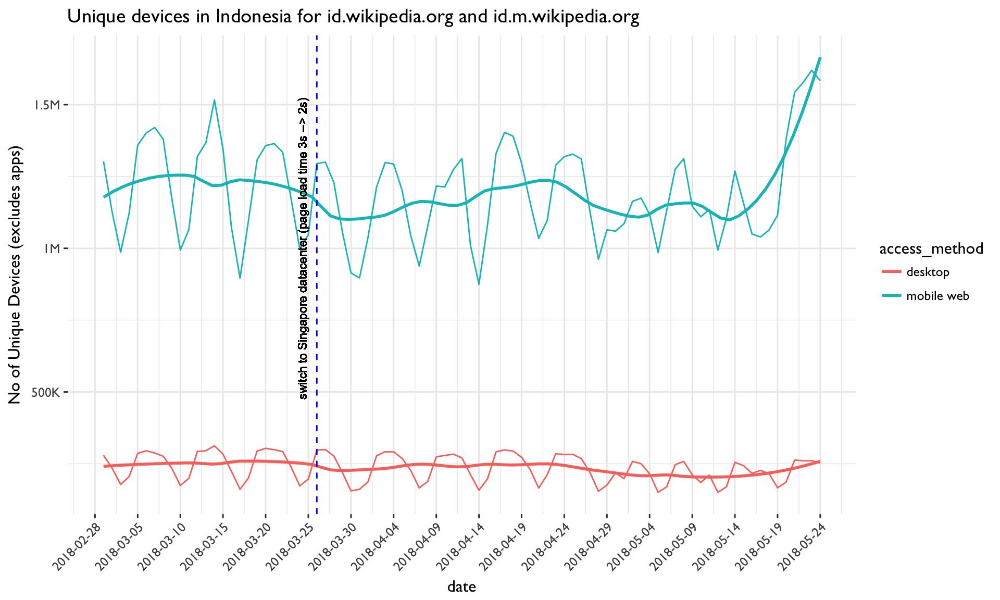

# Measure impact of Singapore data center on Wikimedia usage
Codebase to [T184677](https://phabricator.wikimedia.org/T184677)

Around the end of March 2018, Wikimedia traffic started being routed through a new data center in Singapore, which resulted in improvments to page load times in the impacted regions. This analysis reviews any effects of this service rollout on readership performance. We specifically looked at any effects on pageviews, unique devices, and average user return time for the countries identified as having significant load time changes due to the rollout: Indonesia, Bangladesh, Japan and India

## Wikimedia Pageviews

## Daily unique devices estimate

## Average users returns within 31 days

## Year-over-year review of pageviews on mobile

