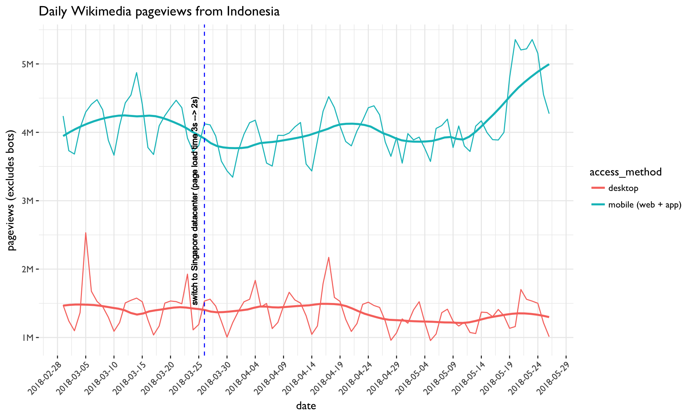

# Measure impact of Singapore data center on Wikimedia usage
Codebase to [T184677](https://phabricator.wikimedia.org/T184677)

## Wikimedia Pageviews

## Daily unique devices estimate

## User retention (average returns within 31 days)

